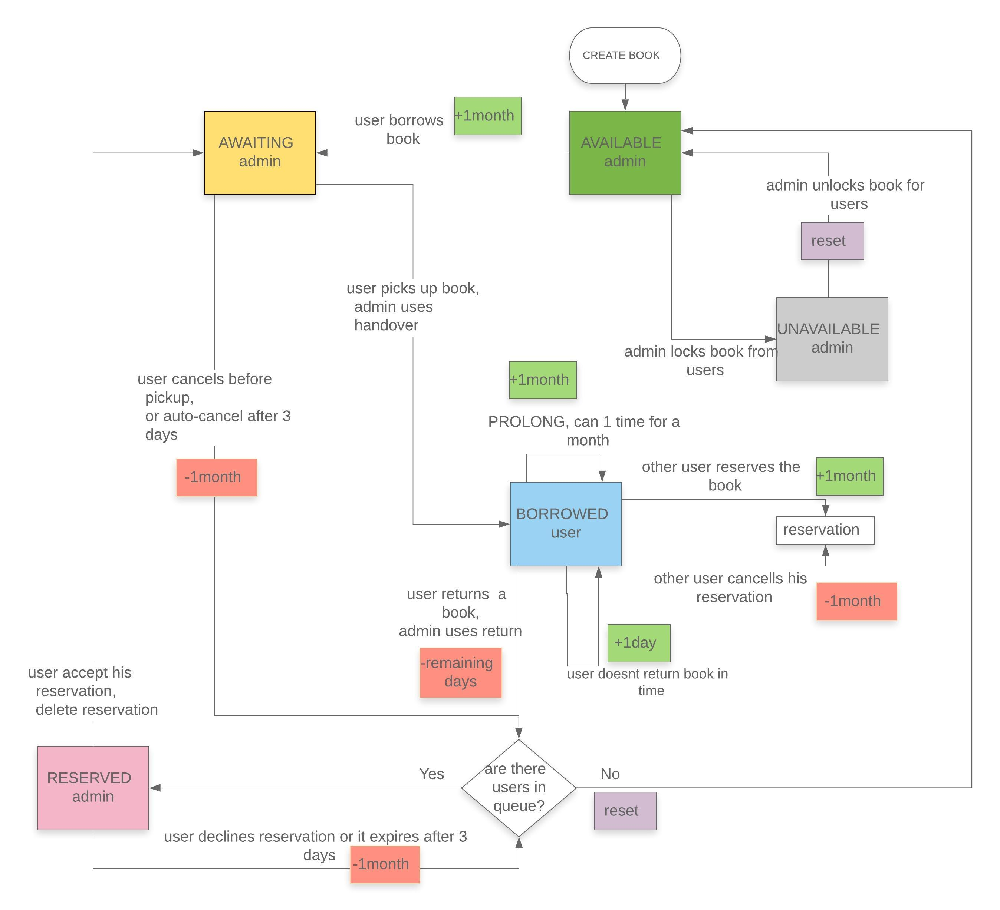
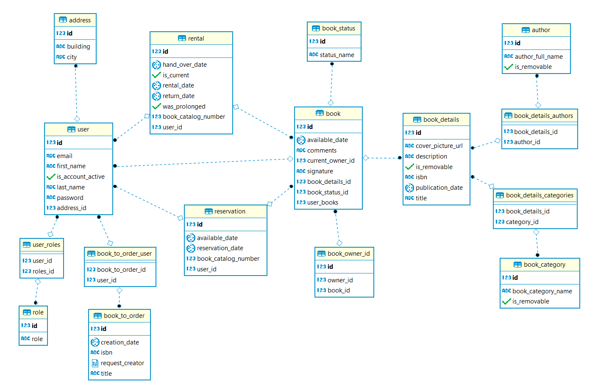

# innovativeproject-nokia-library
## Table of contents
1. Project overview
2. Functionality
3. Technical details
4. Technologies
5. Installation guide
6. Contributing

# 1. Project overview
The goal of the project is to create a library web application.

Demo app available at: https://nokia-library-client.herokuapp.com

YouTube channel with demo videos: https://www.youtube.com/channel/UCMjGWoNeU5F-XZO6ejpe5Fw/videos

# 2. Functionality
For all users:
* Borrowing and reserving books,
* cancelling borrowings and reservations,
* prolongation of borrowed books,
* requesting new books,
* subscribing (or unsubscribing) to existing book requests,
* history of user's borrowings,
* contact with developers (report a bug, request new feature, etc.),
* user accounts,
* night theme,
* editing user account data,
* email notifications in following situations:
  * borrowing a book - info where to pick it up,
  * reminder about upcoming return date,
  * notification about not returning a book in time,
  * reservation is ready to accept/reject,
  * requested book is available in the library,
  * requested book was rejected and never will be added to the library,
  

For admins only:
* Books management (add, edit, remove),
* semi-automated book details completion,
* authors and categories management,
* handing over books to users,
* returning books,
* list of requested books,
* history of the borrowings of all the admin's books,
* promoting users to new admins,
* demoting existing admins to regular users,
* sharing books with another admin,
* transferring books to different admin.


# 3. Technical details
The business logic of main features which are borrowing and reserving books (and everything related to them) are explained on below flowchart:

5 big rectangles are different states of book: available, awaiting, borrowed, reserved, unavailable. 
For every action taken by user or admin, estimated availability date could be changed by days or month, or it can reset back to default (small rectangles).




Below you can see database schema used in the project.


# 4. Technologies
* Backend
  * [PostgreSQL](https://www.postgresql.org/)
  * [Java 8](https://www.java.com)
  * [Spring 5](https://spring.io/)
  * [JUnit 5](https://junit.org/junit5/)
  * [Mockito 2](https://site.mockito.org/)
* Frontend
  * [Angular 7](https://angular.io/)
  * [Angular Material 7](https://material.angular.io/)
* Other
  * [Docker](https://www.docker.com/)
  * [Travis CI](https://travis-ci.org/)
  * [Swagger UI](https://swagger.io/)
  * [Heroku](https://www.heroku.com/)
  * [Cloudinary](https://cloudinary.com/) 

# 5. Installation guide
1. Install docker on your local machine.
2. In a project's source folder execute: ``` docker-compose up ```

# 6. Contributing
Students:
* Mikołaj Banaszkiewicz
* Alex Kostiukov [Github](https://github.com/KostiukovAleksey)
* Wojciech Spoton [Github](https://github.com/SpokoSpartan)
* Jacek Zalewski [Github](https://github.com/tubidubidam)

Nokia supervisors:
* Mateusz Płuciennik
* Adam Dyngosz
* Mateusz Wierzbicki